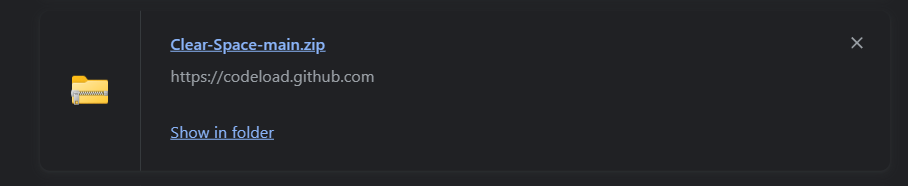
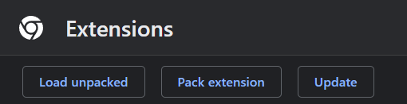
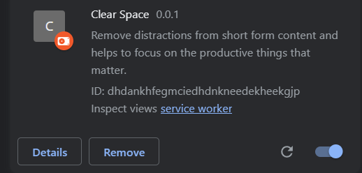

## Installation

**Clear space is currently submitted for review on chrome web store and will be available to users soon.**

### Installation on Chromium-based browsers

To install Clear Space in your browser, follow the steps mentioned below :

1. Download [zip folder](https://github.com/Santhoshmani1/Clear-Space/archive/refs/heads/main.zip) of the repository and extract the file contents.

    

2. Go to [browser://extensions](browser://extensions/) page and turn on developer mode.

   

3. Click on load unpacked and select the clear space folder.

   

4. Once the extension is installed, you will see the Clear Space icon in the top right corner of your browser.

5. Tap on the icon and allow the extension to access Youtube.

   

---
