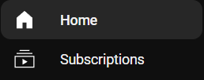
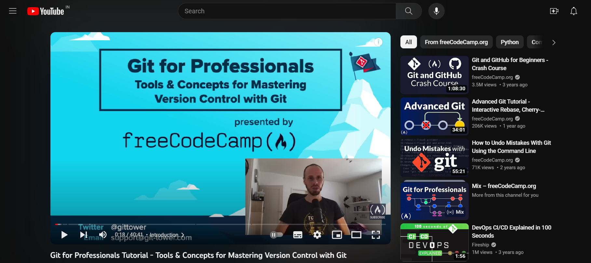
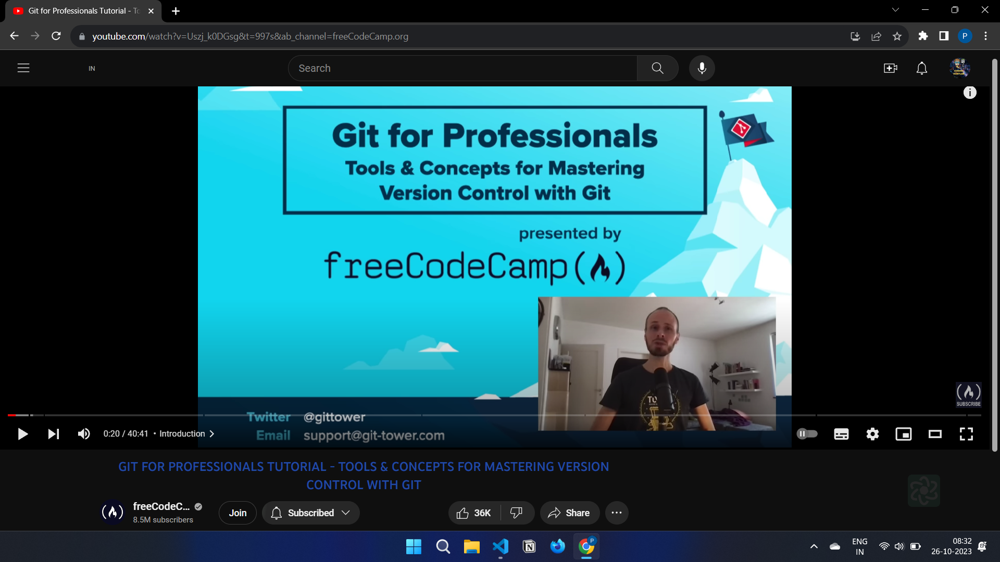

# Clear space

## What is Clear Space ?

Clear Space is a chrome extension which helps you to remove distractions from short form video content and focus on the productive things that matter.

---

## Features

- **Blocks YouTube Shorts:**
  blocks the Shorts tab on YouTube and prevent users from getting distracted by short videos.
  
  

- **Blocks Comments:**
  blocks the comments section on YouTube and prevents you from getting distracted by comments.
  
- **Blocks Recommendations:**
  This feature blocks the recommendations section on YouTube and prevent users from getting distracted by recommended videos.
  
  
  
  

---

## Installation

See [Installation guide](./docs/installation.md) for detailed step by step instructions on how to install the latest version.

## What's next for clear-space

- Making the extension accessible for firefox and support for other major browsers.
- Increasing functionality for other major social media platforms.

## Contributing

All contributions are welcome.

Please read our [CONTRIBUTING.md](https://github.com/santhoshmani1/Clear-space/blob/main/contributing.md) for additional help and resources for getting started.

## LICENSE

Clear Space is licensed under the MIT License. See the LICENSE file for more information.
