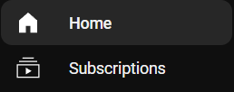
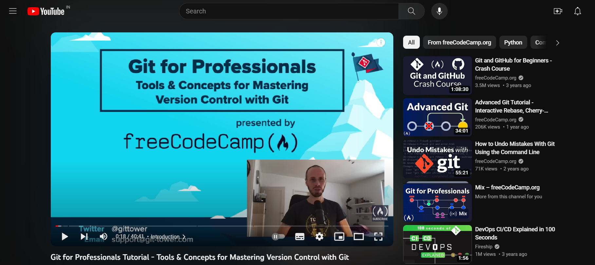
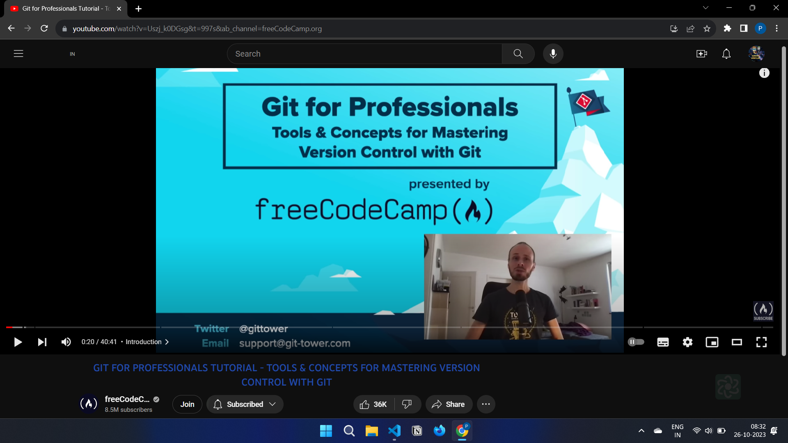
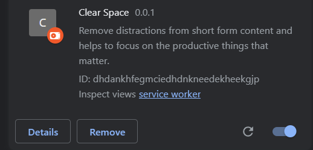

# Clear space

## What is Clear Space ?

Clear Space is a chrome extension which helps you to remove distractions from short form video content and focus on the productive things that matter.

---

<h3 align="left">Join discord server</h3>

## Features

- **Blocks YouTube Shorts:**
  blocks the Shorts tab on YouTube and prevent users from getting distracted by short videos.
  
  

- **Blocks Comments:**
  blocks the comments section on YouTube and prevents you from getting distracted by comments.
  
- **Blocks Recommendations:**
  This feature blocks the recommendations section on YouTube and prevent users from getting distracted by recommended videos.
  
  
  
  

---

## Installation

To install Clear Space in your browser, follow the steps mentioned below :

1. Download [zip folder](https://github.com/Santhoshmani1/Clear-Space/archive/refs/heads/main.zip) of the repository and extract the file contents.

    
   
2. Go to [chrome://extensions](chrome://extensions/) page and turn on developer mode.
   
   
   
3. Click on load unpacked and select the clear space folder.

   

4. Once the extension is installed, you will see the Clear Space icon in the top right corner of your browser.
   
5. Tap on the icon and allow the extension to access Youtube.
   
   

---

## What's next for clear-space

- Making the extension accessible for firefox and support for other major browsers.
- Increasing functionality for other major social media platforms.

## Contributing

All contributions are welcome.
Please read our [CONTRIBUTING.md](https://github.com/santhoshmani1/Clear-space/blob/main/contributing.md) for additional help and resources for getting started.

## LICENSE

Clear Space is licensed under the MIT License. See the LICENSE file for more information.
